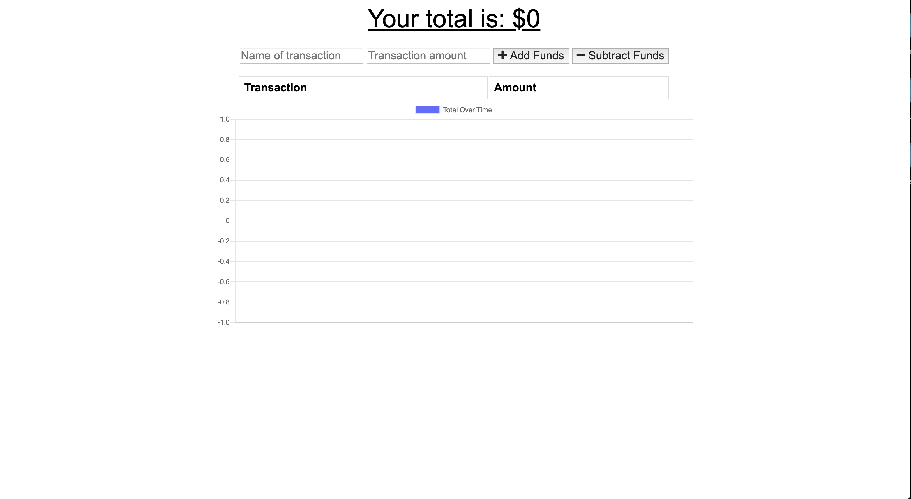
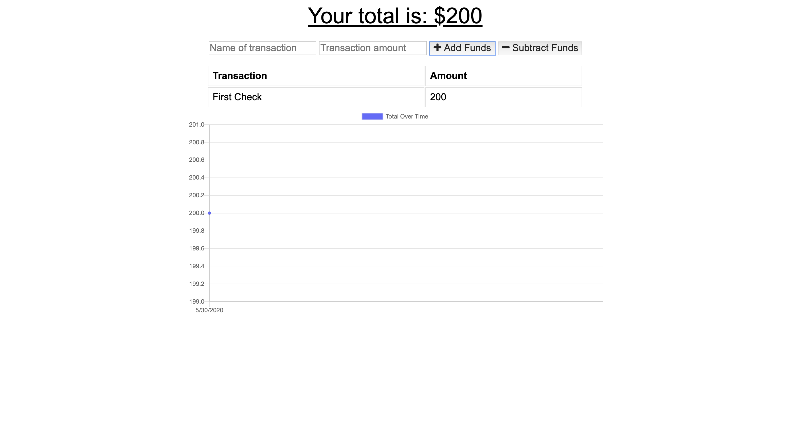
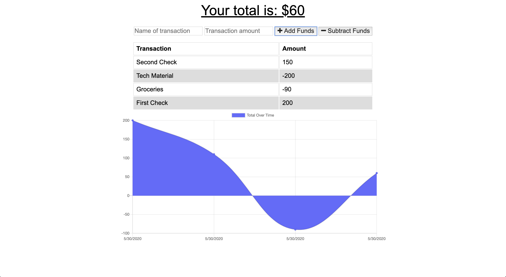

# opus18_PWA-Budget-Tracker

  

## Description

This application is a budget tracker for a person on the go. It allows the user to add expenses and deposits to their budget. The application will allow the user to save changes to the budget offline and have the changes added when the tracker is brought back online. The application utilizies Node.js, Javascript, HTML, CSS and MongoDB.

## Table of Content

* [Installation](#installation)

* [Repository](#repository)

* [Deployment](#deployment)

* [Usage](#usage)

* [License](#license)

* [Contributing](#contributing)

* [Tests](#tests)

* [Questions](#questions)

## Installation

To run on a local system, clone the repository into the directory of choice, then run:
```
node server.js
```
This will start up the application.

## Repository

This project's repository is at: [opus18_PWA-Budget-Tracker](https://github.com/AJFree458/opus18_PWA-Budget-Tracker)

## Deployment

This application is currently deployed through [Budget Tracker on Heroku](https://fathomless-eyrie-65049.herokuapp.com/).

## Usage

To use this application, go to the deployed web page. This is how it looks with no deposits or expenses added.



After you enter values into the appropriate fields, select the correct the button to add or subtract the expense or deposit.



When the application is more filled out, it will look more this:



## License


This project is not under a license.

## Contributing

Please report issues and concerns. Fork the repo if desired, and do requests.

## Credit

Main Contributor: Arthur Freeman

## Tests

At this time, there are no tests to be run.

## Questions


If you have any questions about the repo, open an issue or contact [AJFree458](https://api.github.com/users/AJFree458) directly at rthr.frmn@gmail.com.